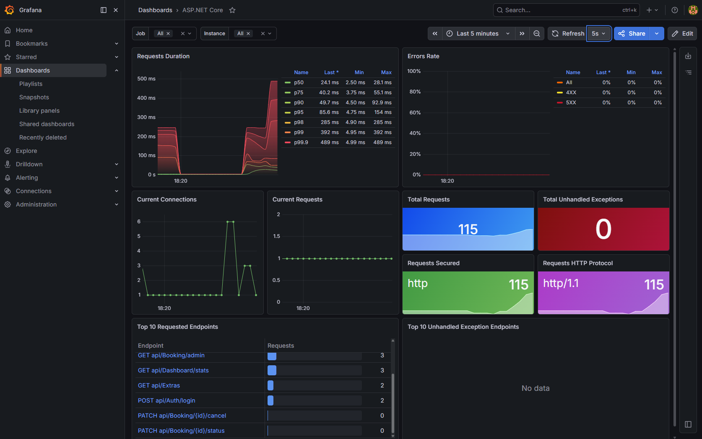

# RentGrid

**RentGrid** is a full-stack car rental management system developed as part of an MSc coursework project.
It demonstrates the design and implementation of a complete web-based system, including backend services, frontend application, database integration, and system observability.

---

## Academic Context

This project was created to fulfill the requirements of a university assignment focused on building a complete web system.

### Covered Requirements

* Full-stack web application (frontend + backend)
* RESTful API with CRUD operations
* Authentication and user registration
* Session handling (JWT-based)
* Database integration with multiple entities and relationships
* Web-based GUI for user interaction
* Software documentation (`/docs` folder)
* AI usage and prompt analysis (`/prompts` folder)

---

## Features

*  JWT-based authentication & authorization
*  User registration and management
*  Vehicle management (CRUD operations)
*  Booking system
*  Image storage using MongoDB GridFS
*  API monitoring with Prometheus & Grafana
*  RESTful API architecture

---

##  Tech Stack

### Backend

* ASP.NET Core (.NET 10)
* Entity Framework Core
* SQL Server
* MongoDB (GridFS)

### Frontend

* Angular (v21)

### Observability & DevOps

* Docker
* Prometheus
* Grafana
* OpenTelemetry

---

## Requirements

### Backend

* .NET 10

### Frontend

* Node.js 20+
* Angular 21

### Databases

* SQL Server
* MongoDB

### Optional

* Docker

---

## Project Structure

```plaintext
RentGrid/
├── RentGrid.Api/           # ASP.NET Core backend
├── RentGrid.Web/           # Angular frontend
├── RentGrid.Api.Tests/     # Tests
├── docs/                   # Documentation (assignment requirement)
├── prompts/                # AI usage analysis (assignment requirement)
├── docker-compose.yml      # Containerized setup
```

---

##  Getting Started

### Option 1 – Docker (Recommended)

```bash
docker-compose up --build
```

This will start:

* Backend API
* Frontend application
* Prometheus
* Grafana

---

### Option 2 – Manual Setup

#### Backend

```bash
cd RentGrid.Api
dotnet restore
dotnet run
```

#### Frontend

```bash
cd RentGrid.Web
npm install
ng serve
```

---

## Authentication

The system uses **JWT Bearer authentication**.
Only authenticated users can perform CRUD operations, as required by the assignment.

---

##  Monitoring

The application includes **observability features** using:

* OpenTelemetry for instrumentation
* Prometheus for metrics collection
* Grafana for visualization

These tools provide insight into:

* request latency
* error rates
* endpoint usage

---

##  Screenshots

### API Monitoring (Grafana)



---

##  Documentation

* Detailed system documentation is available in the `/docs` folder
* AI usage and prompt analysis can be found in the `/prompts` folder

---

## Technology Choices

The selected technologies were chosen based on the following considerations:

* **ASP.NET Core** – robust and scalable backend framework
* **Angular** – structured frontend for maintainable UI development
* **SQL Server** – reliable relational data storage
* **MongoDB (GridFS)** – efficient handling of binary data (images)
* **Docker** – simplifies environment setup and ensures consistency
* **Prometheus & Grafana** – enable production-style monitoring and diagnostics

---

##  Additional Notes

While the project fulfills all academic requirements, it also includes additional features such as monitoring and containerization, demonstrating a production-oriented development approach.

---

##  Author

Developed by **Csabai Albert**
