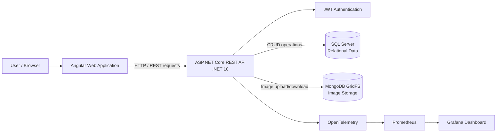

# RentGrid – Rendszer dokumentáció

## 1. Bevezetés

A RentGrid egy teljes webalapú rendszer, amely egy autókölcsönző szolgáltatás működését modellezi.
A rendszer célja, hogy lehetővé tegye járművek kezelését, foglalását, valamint felhasználók regisztrációját és hitelesítését egy modern, skálázható architektúra keretében.

A projekt egy MSc szintű beadandó keretében készült, és egy teljes webes rendszer megvalósítását demonstrálja.

---

## 2. Rendszer áttekintés

A rendszer három fő komponensből áll:

* **Backend (REST API)** – üzleti logika és adatkezelés
* **Frontend (web alkalmazás)** – felhasználói felület
* **Adatbázisok** – perzisztens adattárolás

A komponensek HTTP alapú kommunikáción keresztül kapcsolódnak egymáshoz.

---

## 3. Technológiai stack és indoklás

 A rendszer kialakításánál a cél egy modern, jól skálázható és karbantartható architektúra létrehozása volt. A választott technológiák ezt a célt szolgálják.

### Backend

* **ASP.NET Core (.NET 10)**
  A backend megvalósításához az ASP.NET Core keretrendszer került kiválasztásra, mivel magas teljesítményt, platformfüggetlenséget és széleskörű ökoszisztémát biztosít.
 A REST API-k fejlesztésére kifejezetten alkalmas, és natívan támogatja az olyan fontos architekturális megoldásokat, mint a dependency injection, middleware pipeline és aszinkron feldolgozás.
 A .NET 10 verzió használata lehetőséget adott a legújabb fejlesztések és optimalizációk kipróbálására.

* **Entity Framework Core**
  Az adatbázis-kezeléshez az Entity Framework Core ORM keretrendszer került alkalmazásra.
  Ez leegyszerűsíti az adatbázis-műveleteket azáltal, hogy objektum-orientált módon lehet dolgozni az adatokkal, csökkentve a kézzel írt SQL mennyiségét.
  Támogatja a LINQ lekérdezéseket és a migrációkat, amelyek megkönnyítik az adatmodell változásainak kezelését.

---

### Frontend

* **Angular 21**
  A frontend Angular keretrendszerrel készült, amely egy erősen strukturált, komponens-alapú architektúrát biztosít.
  Előnye, hogy jól skálázható nagyobb alkalmazások esetén, és beépített megoldásokat kínál routingra, formkezelésre és HTTP kommunikációra.
  Az Angular használata segíti a kód modularizálását és a hosszú távú karbantarthatóságot.

---

### Adatbázis

* **SQL Server**
  A relációs adatok tárolására SQL Server került kiválasztásra, amely megbízható és széles körben használt adatbázis-kezelő rendszer.
  Erőssége a tranzakciókezelés, az adatintegritás biztosítása és a komplex lekérdezések hatékony kezelése.

* **MongoDB (GridFS)**
  A képek tárolására MongoDB GridFS került alkalmazásra.
  Ennek oka, hogy a bináris adatok (pl. képfájlok) kezelése relációs adatbázisban nem optimális.
  A GridFS lehetővé teszi nagy fájlok hatékony tárolását és stream-alapú kezelését, ami jól illeszkedik a webes alkalmazások működéséhez.

---

### DevOps és monitoring

* **Docker**
  A Docker használata biztosítja a környezetek egységességét és a rendszer egyszerű telepítését.
  A konténerizáció lehetővé teszi, hogy az alkalmazás minden komponense (backend, frontend, adatbázisok) reprodukálható módon fusson különböző környezetekben.

* **Prometheus**
  A Prometheus egy időalapú metrikagyűjtő rendszer, amely rendszeresen lekérdezi az alkalmazás által publikált adatokat.
  Segítségével monitorozható például a válaszidő vagy a hibaarány.

* **Grafana**
  A Grafana vizualizációs eszközként szolgál, amely a Prometheus által gyűjtött adatokat grafikonok és dashboardok formájában jeleníti meg.
  Ez segíti a rendszer állapotának gyors áttekintését és a problémák azonosítását.

* **OpenTelemetry**
  Az OpenTelemetry keretrendszer segítségével az alkalmazás működéséről metrikák és trace-ek gyűjthetők.
  Ez lehetővé teszi a rendszer viselkedésének mélyebb megértését.

* **Összegzés**
  A technológiai stack kiválasztásánál a fő szempontok a skálázhatóság, karbantarthatóság és modern fejlesztési gyakorlatok alkalmazása voltak.
  A választott megoldások együtt egy stabil és bővíthető rendszert alkotnak, amely közel áll egy valós, éles környezetben működő alkalmazáshoz.
---

## 4. Funkcionális követelmények

A rendszer az alábbi funkciókat valósítja meg:

* Felhasználók regisztrációja
* Bejelentkezés és hitelesítés (JWT)
* Járművek kezelése (CRUD műveletek)
* Foglalások kezelése (CRUD műveletek)
* Képek feltöltése és lekérése
* Hitelesített hozzáférés az API végpontokhoz

---

## 5. Nem-funkcionális követelmények

### Teljesítmény

A rendszer aszinkron műveleteket használ a jobb skálázhatóság érdekében.

### Biztonság

* JWT alapú hitelesítés
* Védett API végpontok
* Input validáció

### Karbantarthatóság

* Rétegzett architektúra
* Szolgáltatás-alapú felépítés
* Dependency Injection használata

### Skálázhatóság

* REST alapú architektúra
* Konténerizált környezet

### Megfigyelhetőség (Observability)

* Request metrikák gyűjtése
* Hibák monitorozása
* Grafana dashboardok használata

---

## 6. Adatmodell

A rendszer legalább 5 entitást tartalmaz, például:

* User
* Vehicle
* Booking
* Image
* Role / Permission

Az entitások között relációk vannak (pl. felhasználó – foglalás kapcsolat).

---

## 7. Rendszer működése

1. A felhasználó a webalkalmazáson keresztül kérést indít
2. A frontend HTTP kérést küld a backend API-nak
3. A backend feldolgozza a kérést
4. Az adatbázisból lekérdezi vagy módosítja az adatokat
5. A válasz visszakerül a frontendhez
6. Az eredmény megjelenik a felhasználói felületen

---

## 8. AI használat

A fejlesztés során AI eszköz (GitHub Copilot) került felhasználásra:

* kódgenerálás
* hibakeresés
* struktúra kialakítása

A használt promptok és azok elemzése a `/prompts` mappában található.

---

## 9. Összegzés

A RentGrid egy teljes értékű webalkalmazás, amely megfelel a projektkövetelményeknek, és modern fejlesztési eszközöket alkalmaz.

A rendszer nemcsak a szükséges funkciókat valósítja meg, hanem kiegészítő megoldásokkal (pl. monitoring, konténerizáció) is rendelkezik, amelyek közelebb hozzák egy valós, éles környezetben működő rendszerhez.

---

## Technológiai döntések indoklása

A rendszer kialakításánál nem kizárólag egyetlen adatbázis-technológia került alkalmazásra.

A relációs adatokat (pl. felhasználók, foglalások) SQL Server tárolja, mivel ezeknél fontos az adatintegritás és a strukturált lekérdezhetőség.  
Ezzel szemben a képek tárolására MongoDB GridFS került kiválasztásra, mivel a bináris adatok kezelése relációs adatbázisban nem hatékony.

Ez a megközelítés lehetővé teszi, hogy minden adattípus a számára legmegfelelőbb tárolási megoldást használja.

A frontend esetében Angular került kiválasztásra a jól strukturált, skálázható felépítése miatt, szemben egyszerűbb, de kevésbé strukturált megoldásokkal.

Összességében a technológiai döntések célja egy olyan rendszer kialakítása volt, amely egyensúlyt teremt a fejlesztési hatékonyság és a hosszú távú karbantarthatóság között.

---

## Rendszerarchitektúra

A RentGrid rendszer kliens-szerver architektúrát követ. A felhasználó az Angular alapú webalkalmazáson keresztül használja a rendszert, amely HTTP kéréseket küld az ASP.NET Core alapú REST API felé.

A backend felelős az üzleti logikáért, a hitelesítésért, valamint az adatbázis-műveletek végrehajtásáért. A relációs üzleti adatok SQL Server adatbázisban tárolódnak, míg a képek MongoDB GridFS segítségével kerülnek mentésre.

A rendszer observability funkciókat is tartalmaz. Az alkalmazás metrikáit OpenTelemetry gyűjti, amelyeket a Prometheus dolgoz fel, majd a Grafana dashboardokon lehet megjeleníteni.

